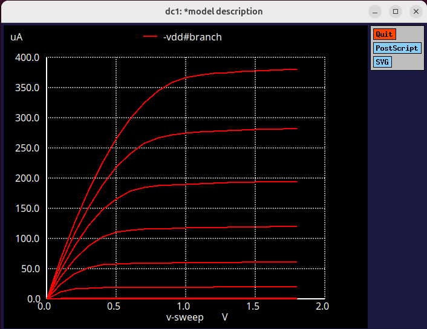

# LAB 1: Experiment 1: NMOS transistor and its DC Characteristics

The objective of this experiment is to simulate and study the Id vs Vds charactreristics of an NMOS transistor using Sky130 technology models.
Through this, w e aim to understand the behaviour of the transistor across its three operating regions- cutoff, linear and saturation and observe how variations in Vgs influence the drain current (Id).
This analysis provides a foundation for comprehending transistor-level operation, device modeling, and circuit design aspects such as carrier mobility, channel length modulation and threshold volatge.

---
## Model Description
```
.param temp=27

* Including sky130 library files
.lib "sky130_fd_pr/models/sky130.lib.spice" tt

* Netlist Description
XM1 Vdd n1 0 0 sky130_fd_pr__nfet_01v8 w=5 l=2
R1 n1 in 55

Vdd vdd 0 1.8V
Vin in 0 1.8V

* Simulation commands
.op
.dc Vdd 0 1.8 0.1 Vin 0 1.8 0.2

.control
run
display
setplot dc1
.endc

.end
```
## Simulation Configuration:
- Tool used: ngspice
- Technology: Sky 130nm PDK
- Device type: Nmos (sky130_fd_pr__nfet_01v8)
- Bias Range:
        - Vdd: 0V -> 1.8 V
        - Vin: 0V -> 1.8 V
This setup allowed the observation of drain current(Id) as the drain-source voltage(Vds) and the gate-source Voltage(Vgs) of the transistor is varied across the operating region.

## Obseravtions:
When Vgs=0.6V, a very small current was recorded, indicating that the device was near the cutoff region. For lower gate voltages such as 0.2V and 0.4V, no output characteristics appeared since the transisot remained off because the Vgs was less than the threshold voltage and hence the conduction did not occur.

## Introduction to Spice Simulations:
A detailed introduction on writing the Spice netlist for this Nmos and Pmos transistors were shown

# Example(Spice Netlist):
```
M1 Vdd n1 0 0 nmos L=1.8u W=1.2u
R1 in n1 55
Vdd vdd 0 2.5
Vin in 0 2.5
.dc Vds 0 1.8 0.05
.plot dc I(M1)
.end

.Model nmos NMOS (Tox= ... + U0 = .... + GAMMA1= ...)  #Technology file
```
## Spice description of Experiment 1 (Nmos Id vs Vds):
```
*Model Description
.param temp=27


*Including sky130 library files
.lib "sky130_fd_pr/models/sky130.lib.spice" tt


*Netlist Description


XM1 Vdd n1 0 0 sky130_fd_pr__nfet_01v8 w=5 l=2

R1 n1 in 55

Vdd vdd 0 1.8V
Vin in 0 1.8V

*simulation commands

.op
.dc Vdd 0 1.8 0.1 Vin 0 1.8 0.2

.control

run
display
setplot dc1
.endc

.end
```
## Commands to run this Spice simulation
file name: day1_nfet_idvds_L2_W5.spice
```
ngspice day1_nfet_idvds_L2_W5.spice
plot -vdd#branch
```
## Output (Nmos Characteristics):


## Result: (Observed Parameters):
- Threshold Voltage : 0.55V
- Saturation Voltage : Vgs-Vth(Observed from the plot)
- Channel length modulation: Lambda( small slope in the saturation region)

## Conclusion:
This experiment verified the DC characteristics of an Nmos transistor using SKY130 technology, clearly showing cutoff, linear, and saturation regions. The threshold voltage(0.55V approx) and slight channel length modulation observed aligned well with the theoretical expectations.


  

