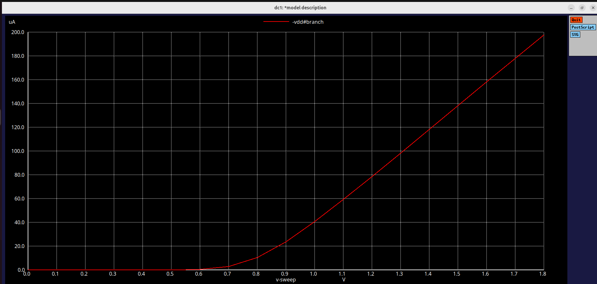
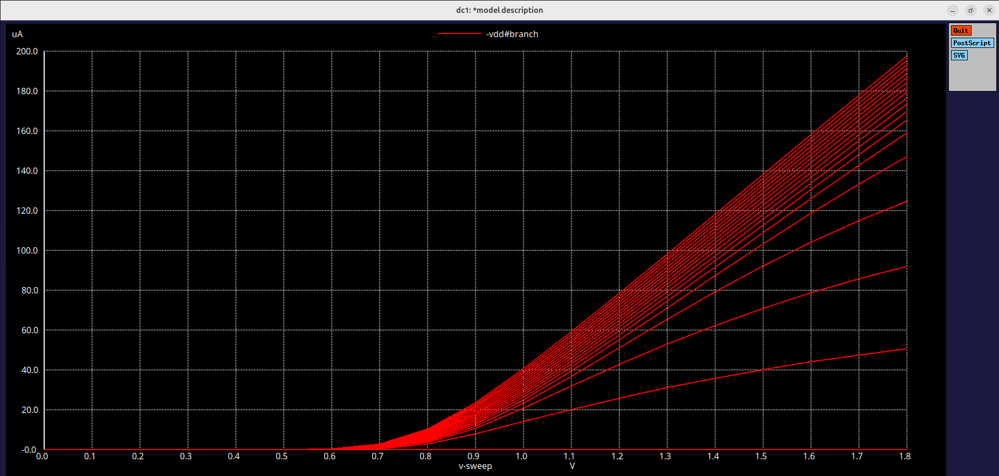

## Lab 2 : Experiment 2 Nmos Id vs Vgs and Id vs Vds characteristics

The objective of this week is to study the DC behaviour and switching characteristics of MOSFETs using SPICE simulations and   Sky130 models. 
The week focuses on understanding velocity saturation, drain current models and constructing CMOS inverter VTC from NMOS-PMOS characteristics.

## Nmos- Id vs Vds 
# Model 
```
*Model Description
.param temp=27


*Including sky130 library files
.lib "sky130_fd_pr/models/sky130.lib.spice" tt


*Netlist Description


XM1 Vdd n1 0 0 sky130_fd_pr__nfet_01v8 w=0.39 l=0.15

R1 n1 in 55

Vdd vdd 0 1.8V
Vin in 0 1.8V

*simulation commands

.op
.dc Vdd 0 1.8 0.1 Vin 0 1.8 0.2

.control

run
display
setplot dc1
.endc

.end
```
## Output plot (Id vs Vds)


This plot represents:
| Parameter        | Region / Quantity          | Description                                 |
|------------------|----------------------------|---------------------------------------------|
| X-axis (v sweep) | Drain-Source Voltage (Vds) | The voltage applied across the MOSFET       |
| Y-axis (µA)      | Drain Current (Id)         | The current flowing through the transistor  |
| Low Vds region   | Linear region              | Current increases almost linearly with Vds  |
| High Vds region  | Saturation region          | Current saturates & becomes nearly constant |


This graph confirms normal Mosfet operation that is linear region at low VDS , saturation at higher Vds, and increasing Id with higher Vgs. 
Its typically the output characteristics plot of an NMOS transistor obtained from a DC SPICE simulation.

The peak current of the plot is viewed as 
.png)

## Nmos- Id vs Vgs:
# Model:
```
*Model Description
.param temp=27


*Including sky130 library files
.lib "sky130_fd_pr/models/sky130.lib.spice" tt


*Netlist Description

XM1 Vdd n1 0 0 sky130_fd_pr__nfet_01v8 w=0.39 l=0.15

R1 n1 in 55

Vdd vdd 0 1.8V
Vin in 0 1.8V

*simulation commands

.op
.dc Vin 0 1.8 0.1

.control

run
display
setplot dc1
.endc

.end
```
## Output plot (Id vs Vds)


This plot represents:
| Parameter        | Quantity / Symbol         | Description                                |
|------------------|---------------------------|--------------------------------------------|
| X-axis (v sweep) | Drain-Source Voltage (Vds) | The voltage applied across the MOSFET      |
| Y-axis (µA)      | Drain Current (Id)         | The current flowing through the transistor |
| When Vgs < Vt    | Id ≈ 0                    | The MOSFET is off                          |
| Once Vgs > Vt    | Current increases rapidly  | This shows the onset of conduction         |


The steep rise after threshold indicates the strong inversion region, where Id increases approximately quadratically with Vgs..
This graph demosntrates how MOSFET transitions from cutoff to saturation as Vgs increases. The point where current begins to rise marks the threshold voltage of the device.

The peak current of the plot is viewed as 
.png)

## Output (Id vs Vgs for Multiple Vds):
```
Model Description
.param temp=27


*Including sky130 library files
.lib "sky130_fd_pr/models/sky130.lib.spice" tt


*Netlist Description

XM1 Vdd n1 0 0 sky130_fd_pr__nfet_01v8 w=0.39 l=0.15

R1 n1 in 55

Vdd vdd 0 1.8V
Vin in 0 1.8V

*simulation commands

.op
.dc Vin 0 1.8 0.1 Vdd 0 1.8 0.1

.control

run
display
setplot dc1
.endc

.end
```



