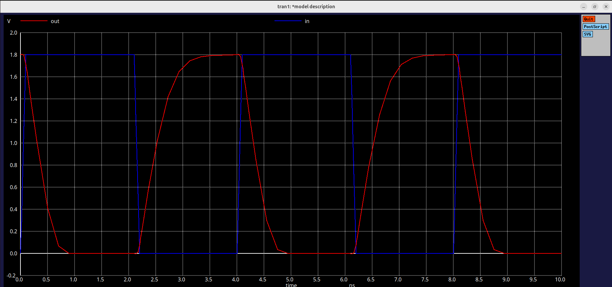
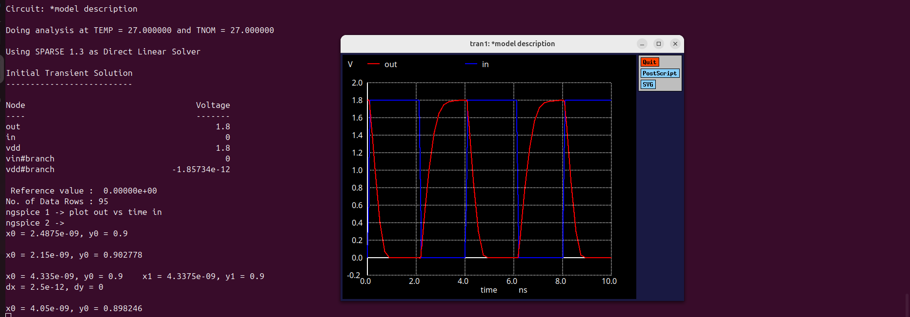
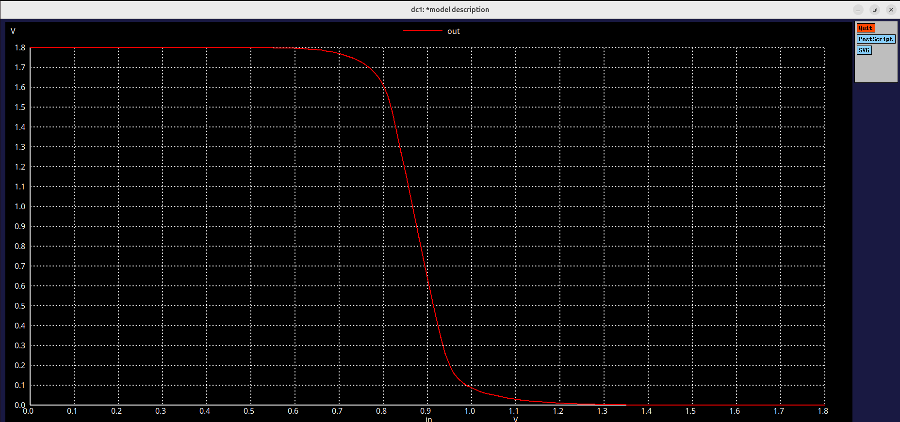
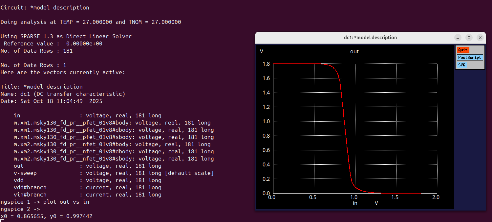

# Lab 3 :Experiment 3 – CMOS Inverter: Static & Dynamic Behavior
# Overview

In this experiment, we learnt how a CMOS inverter behaves in both DC sweepmand transient conditions using Ngspice and the Sky130 PDK.
The goal is to find the switching threshold (Vm) from its VTC curve and study how transistor sizing and analyse the rise delay and fall delay for varying W/L ratio for both pmos and nmos.

# Transient Analysis of CMOS Inverter:
## Model
```
*Model Description
.param temp=27


*Including sky130 library files
.lib "sky130_fd_pr/models/sky130.lib.spice" tt


*Netlist Description


XM1 out in vdd vdd sky130_fd_pr__pfet_01v8 w=0.84 l=0.15
XM2 out in 0 0 sky130_fd_pr__nfet_01v8 w=0.36 l=0.15


Cload out 0 50fF

Vdd vdd 0 1.8V
Vin in 0 PULSE(0V 1.8V 0 0.1ns 0.1ns 2ns 4ns)

*simulation commands

.tran 1n 10n

.control
run
.endc

.end
```
## Output (transient analysis)


The graph demosntrates the correct operation of the CMOS inverter. This shows the strong inversion, propagation delays , rise time , fall time and realistic transient slopes.

## The rise time and fall time is shown by


## Result:

| Parameter    | Value (nanoseconds) |
|:------------:|:-------------------:|
| Rise Time    | 0.337               |
| Fall Time    | 0.287               |

---

# DC Sweep of Cmos Inverter(VTC Curve):
## Model
```
*Model Description
.param temp=27


*Including sky130 library files
.lib "sky130_fd_pr/models/sky130.lib.spice" tt


*Netlist Description


XM1 out in vdd vdd sky130_fd_pr__pfet_01v8 w=0.84 l=0.15
XM2 out in 0 0 sky130_fd_pr__nfet_01v8 w=0.36 l=0.15


Cload out 0 50fF

Vdd vdd 0 1.8V
Vin in 0 1.8V

*simulation commands

.op

.dc Vin 0 1.8 0.01

.control
run
setplot dc1
display
.endc

.end
```
## Output (DC sweep):



This VTC(Voltage Transfer Characteristics) curve of a CMOS inverter shows how the output voltage chnages with respect to the input voltage. 
It illustrates the switching behaviour of the inverter, highlighting regions of logic '0', logic '1', and the switching threshold(Vm) where Vin=Vout and both transistors conduct.

## The switching threshold is found as 0.865 V


## Result:

| Parameter                          | Value / Observation          |
|----------------------------------- |------------------------------|
| Switching Threshold (Vₘ)           | ≈ 0.865V (Vin = Vout)        |
| High-Level Output (V<sub>OH</sub>) | ≈ 1.8 V                      |
| Low-Level Output (V<sub>OL</sub>)  | ≈ 0 V                        |

## Simulation Info

| Parameter     | Details                                                                  |
|----------------|-------------------------------------------------------------------------|
| Tool           | Ngspice                                                                 |
| PDK            | SkyWater 130 nm                                                         |
| PMOS           | sky130_fd_pr__pfet_01v8 → W = 0.84 µm, L = 0.15 µm                      |
| NMOS           | sky130_fd_pr__nfet_01v8 → W = 0.36 µm, L = 0.15 µm                      |
| Supply         | VDD = 1.8 V                                                             |
| Load           | 50 pF                                                                   |
| Input Pulse    | 0 V → 1.8 V, tr/tf = 0.1 ns, width = 2 ns                               |

---

# Insights
The CMOS inverter operates with near-midpoint switching (Vm ≈ VDD/2), confirming balanced PMOS/NMOS strength.

PMOS is sized wider to compensate for lower hole mobility, achieving symmetric transitions.

Capacitive loading dominates delay — larger loads slow both rise and fall edges.

The DC and transient plots validate ideal logic inversion with full 0–VDD swing.

# Summary

- CMOS inverter behaves as expected under both static and dynamic tests.

- Switching occurs near half the supply voltage.

- Rise/fall delays align with theoretical timing from Sky130 device models.

- Understanding these parameters is essential for reliable and high-speed CMOS circuit design.
