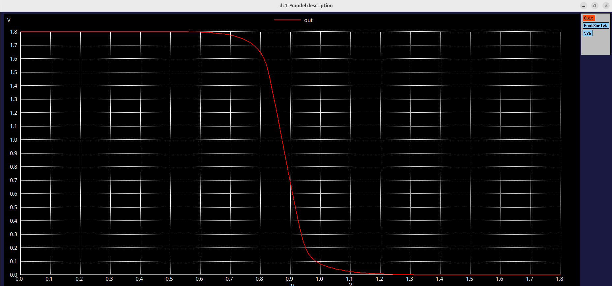
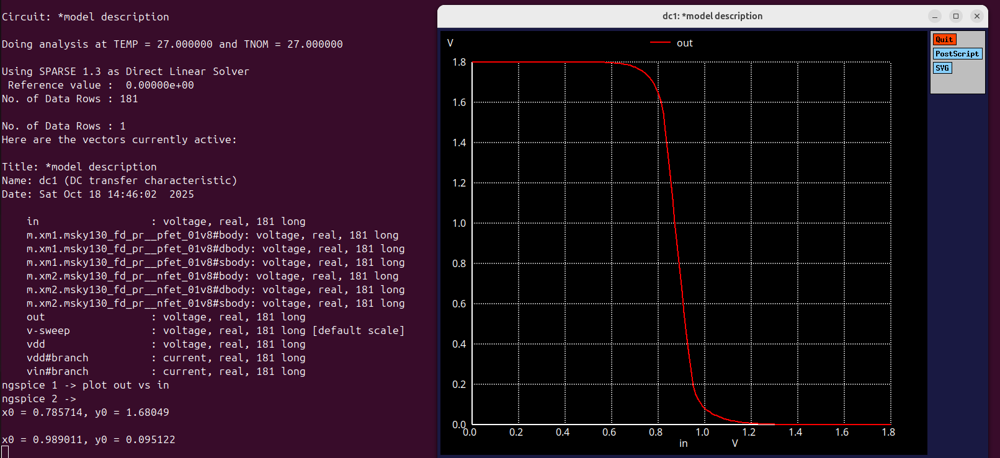

# Lab 4: Experiment 4: CMOS noise margin and robustness evaluation.
# Overview:
The goal of this experiment is to simulate a CMOS inverter using Sky130 process technology and study its static characteristics.
The key tasks include obtaining the Voltage Transfer Characteristics (VTC) curve, determining noise margin(NML AND NMH), evaluating the switching threshold, and analyzing how Pmos width variation affects noise performance and inverter stability.

# Noise Margin
## Model
```
*Model Description
.param temp=27


*Including sky130 library files
.lib "sky130_fd_pr/models/sky130.lib.spice" tt


*Netlist Description


XM1 out in vdd vdd sky130_fd_pr__pfet_01v8 w=1 l=0.15
XM2 out in 0 0 sky130_fd_pr__nfet_01v8 w=0.36 l=0.15


Cload out 0 50fF

Vdd vdd 0 1.8V
Vin in 0 1.8V

*simulation commands

.op

.dc Vin 0 1.8 0.01

.control
run
setplot dc1
display
.endc

.end
```
## Output(Noise Margin):



## The values of NMH(High Noise Margin) and NML(Noise Margin Low) are found.



## Results:
Voltage Transfer Characteristic (VTC)

| Parameter                 | Value / Observation            |
|----------------------------|--------------------------------|
| Switching Threshold (Vm)   | ≈ 0.85 V                       |
| High-Level Output (VOH) | ≈ 1.68 V            |
| Low-Level Output (VOL)  | ≈ 0.095 V           |
| Input Low Voltage (VIL) | ≈ 0.785 V             |
| Input High Voltage (VIH) | ≈ 0.989 V            |
| Noise Margin Low (NML) = (VIL − VOL) | ≈ 0.6914 V |
| Noise Margin High (NMH) = (VOH − VIH) | ≈ 0.6905 V |

## Simulation Setup

- Tool: Ngspice
- Technology:	SkyWater 130 nm PDK
- PMOS:	sky130_fd_pr__pfet_01v8 → W = 1 µm, L = 0.15 µm
- NMOS:	sky130_fd_pr__nfet_01v8 → W = 0.36 µm, L = 0.15 µm
- Supply Voltage:	VDD = 1.8 V
- Load Capacitance:	50 fF
- DC Sweep:	Vin = 0 → 1.8 V, step = 0.01 V

## Observation:
- When the Pmos width was increased compared to earlier experiments, its drive strength improved, causing a light shift in the switching threshold and a corresponding change in noise margins.
- The CMOS inverter demonstrates a well-defined VTC curve with a distinct switching region.
- The extracted NML and NMH values are nearly symmentrical,with minor variation dues to device sizing.
- Proper selection of Pmos and Nmos widths ensures stable operation even under supply or proper fluctuations. The Pmos and Nmos (W/L) ratio influences the switching voltage and both noise margins.
- The analysis confirms thatb transistor sizing significantly affects inverter noise tolerance and logic robustness.
-  This experiment underlines how static performance defines digital reliability and assists in timing analysis and logic design optimization.
  
---

# Conclusion:
Through DC sweep analysis, the VTC of the CMOS inverter was successfully obtained, and noise margins (NML, NMH) were computed.
Increasing PMOS width enhanced its drive capability, leading to a modified switching threshold and balanced noise margins.
These findings emphasize the importance of device sizing in achieving robust and noise-tolerant CMOS logic circuits.


