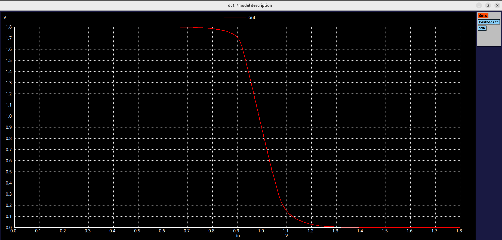
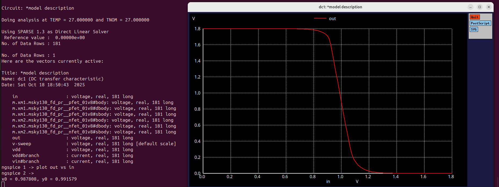
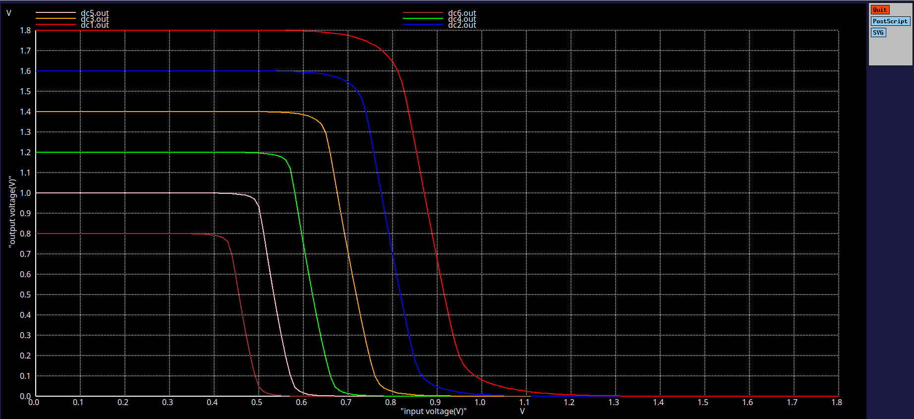
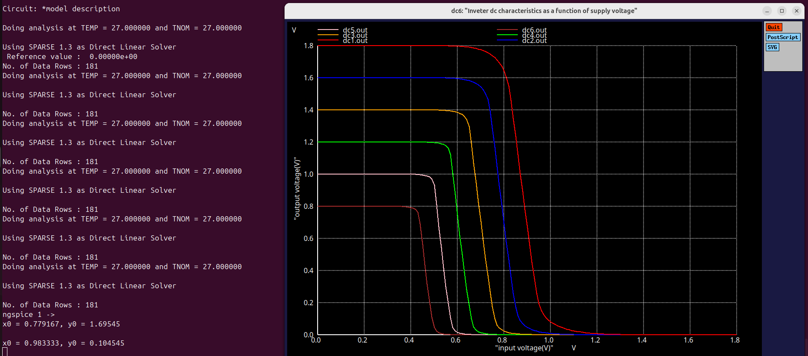

# Lab 5: Experiment 5: Cmos Inverter -  Evaluating Power Supply and Device Variation Robustness

# Objective:

This experiment focuses on analyzing how supply voltage(Vdd) and transistor sizing variations influence the performance of a CMOS inverter designed using Sky130 models.
The goal is to observe the impact of these changes on the Voltage Transfer Characteristics(VTC), switching threshold(Vm) and overall robustness of the inverter, especially in terms of noise margin behaviour.

# Device Variation:
## Model
```
*Model Description
.param temp=27


*Including sky130 library files
.lib "sky130_fd_pr/models/sky130.lib.spice" tt


*Netlist Description


XM1 out in vdd vdd sky130_fd_pr__pfet_01v8 w=7 l=0.15
XM2 out in 0 0 sky130_fd_pr__nfet_01v8 w=0.42 l=0.15


Cload out 0 50fF

Vdd vdd 0 1.8V
Vin in 0 1.8V

*simulation commands

.op

.dc Vin 0 1.8 0.01

.control
run
setplot dc1
display
.endc
.end
```
## Output( Device variation):



## Obseravtion:
With increase in PMOS width, the switching threshold moves slightly toward higher voltages, indicating stronger pull-up strength and a rightward shift in the VTC curve.

## The Switching voltage is found as 0.98V (approx)



---

# Power Supply Variation
## Model
```
*Model Description
.param temp=27

*Including sky130 library files
.lib "sky130_fd_pr/models/sky130.lib.spice" tt


*Netlist Description


XM1 out in vdd vdd sky130_fd_pr__pfet_01v8 w=1 l=0.15
XM2 out in 0 0 sky130_fd_pr__nfet_01v8 w=0.36 l=0.15


Cload out 0 50fF

Vdd vdd 0 1.8V
Vin in 0 1.8V

.control

let powersupply = 1.8
alter Vdd = powersupply
        let voltagesupplyvariation = 0
        dowhile voltagesupplyvariation < 6
        dc Vin 0 1.8 0.01
        let powersupply = powersupply - 0.2
        alter Vdd = powersupply
        let voltagesupplyvariation = voltagesupplyvariation + 1
      end

plot dc1.out vs in dc2.out vs in dc3.out vs in dc4.out vs in dc5.out vs in dc6.out vs in xlabel "input voltage(V)" ylabel "output voltage(V)" title "Inveter dc characteristics as a function of supply voltage"

.endc

.end
```
## Outputs(Power Supply Variation):



## The gain value of the curve at 1.8V is found.



## Observation:
As VDD decreases, both the switching threshold and gain reduce.
At 1.8 V, the inverter gain = 7.78 and slope is -7.78 .

---

# Simulation Setup

- Tool:	Ngspice
- Technology:	SkyWater 130 nm PDK
- Devices	PMOS: sky130_fd_pr__pfet_01v8
- NMOS: sky130_fd_pr__nfet_01v8
- Supply Voltage:	1.8 V (varied down by 0.2 V steps)
- Load Capacitance: 50 fF
- DC Sweep:	Vin = 0 → 1.8 V, step = 0.01 V

# Inference:
- Increasing PMOS width enhances the pull-up strength, resulting in higher Vm and sharper VTC.
-  Reducing supply voltage compresses both NML and NMH, making the inverter more noise-sensitive.
-  Robustness depends on the the correct ratio between Pmos and Nmos dimensions as well as adequate VDD levels.
-  The trade-off between low power design and signal integrity becomes apparent in these simulations.
  
# Conclusion

The study confirms that:

Transistor sizing significantly alters the inverter’s switching point and VTC slope.

Supply voltage reduction leads to smaller noise margins and lower robustness.

Proper device dimensioning and VDD selection are crucial for stable CMOS inverter operation.

This experiment highlights how process variations and voltage scaling must be considered early in design to ensure reliable, low-power digital systems.


